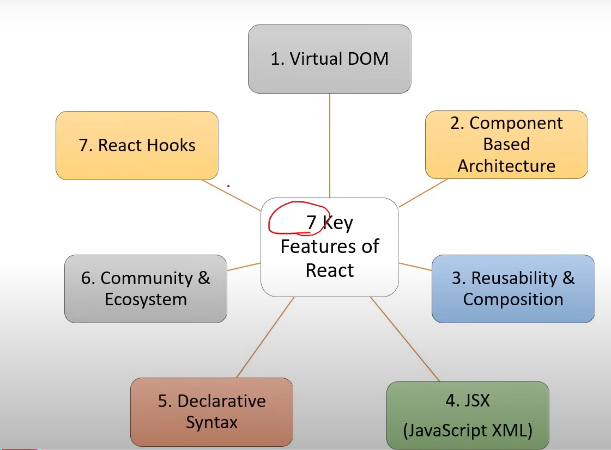

```
User hits website [Sends request to UI/client/Frontend Server] (static contents)

For Dynamic contents UI Server sends request to API/Middleware [Its Responsible for getting and posting the data from the DB] (Dynamic)

The API Sends sends request to update the datas inside the Database server 

Both API server and DB server [Backend]

In the event of GET, the DB will respond with data to the API

API Send the data back to the client 

And client server response to the user
```


# Key Features
- Virtual DOM
- Component based architecture
- Reusability
- JSX
- Declarative Syntax
- Community & Ecosystem
- React Hooks


# HTML & DOM [Document Object Modal]
```
DOM represents a TREE LIKE STRUCTURE, which allows Javascript to dynamically access and manipulate the content or structure of a webPage
```

```
Inside the memory of the Browser, the static HTML => The Memory will see it as a DOM representation / DOM Tree modal [Parent child elements]
```
```
If we do "ADD, DELETE, UPDATE" in the website via JS, one/more node will be created in the DOM.

--> DOM Tree will be converted back to the HTML 
--> Udpated HTML will be displayed to the USER
```


# Virtual DOM 
```
--> React uses "VIRTUAL DOM" to efficiently update the UI "without RE-RENDER the entire page"
--> Helps to improve performance and make the application more responsive.
```
- In DOM, if we make any small minor changes then the browser will Recalculate and rerended/refresh the Entire Page/DOM.

- Problem - The load Time of the Web page, speed and performance.

- To address this problem we have VIRTUAL DOM
- React libraries will take the exact copy of DOM and show that as virtual infront of the user
- when User do interaction, that happens with the Virtual DOM , only the specific part of the VIRTUAL DOM will be udpated.
- In background, the react algorithm of the react libraray only will keep comparing the changes between the virtual DOM and Real DOM. whatever changes updated in Virtual DOM only that will be updated in the actual DOM
- This process of react is RECONSILIATION


